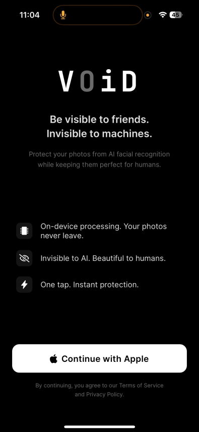
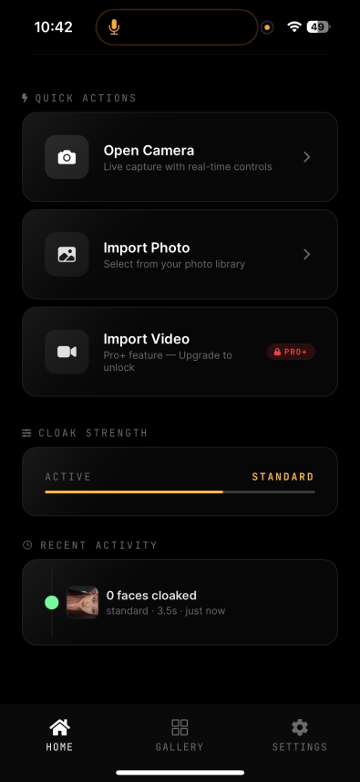
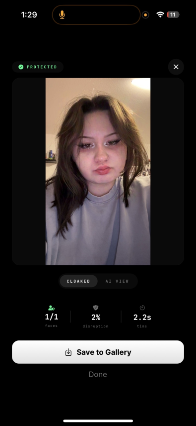
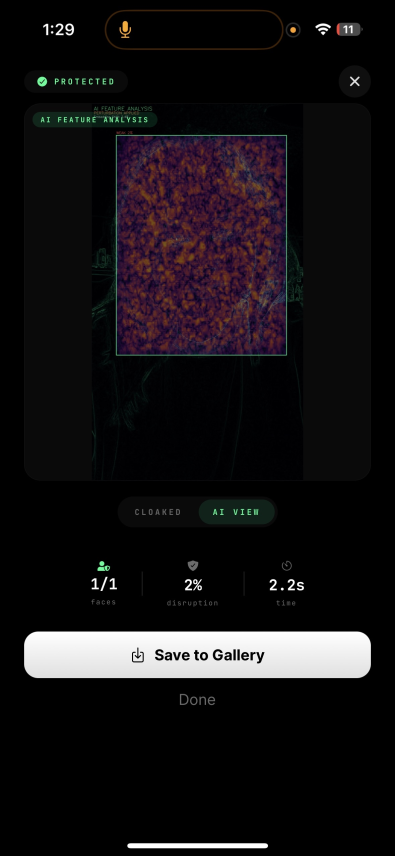

# VOiD

**Be visible to friends. Invisible to machines.**

VOiD is a privacy-focused camera app that applies adversarial perturbations to photos, making them unreadable by AI facial recognition systems while remaining visually identical to the human eye.

Every photo uploaded to the internet gets scraped by facial recognition companies building permanent biometric profiles. VOiD applies mathematically calculated pixel-level perturbations that break these algorithms without degrading image quality.

## Preview

<p align="center">
  
  
  
  
</p>

## Architecture

```
VOiD/
├── mobile/          # Expo React Native (TypeScript)
│   ├── app/         # Expo Router screens
│   ├── components/  # Reusable UI components
│   └── lib/         # ML engine, state, API client
│
└── backend/         # Python FastAPI
    ├── app/api/     # REST endpoints (v1)
    ├── app/core/    # Config, security, encryption
    ├── app/ml/      # Face detection + adversarial cloaking
    └── app/db/      # PostgreSQL models
```

**Cloaking pipeline:** The mobile app sends AES-256-GCM encrypted images to the backend. The backend decrypts, runs face detection (OpenCV DNN) and applies SPSA-based adversarial perturbations to face regions, then re-encrypts and returns the result. Images are never stored server-side.

## Tech Stack

| Layer | Technology |
|-------|------------|
| Mobile | Expo (React Native), TypeScript, Expo Router, Zustand |
| Backend | Python 3.11, FastAPI, SQLAlchemy (async), asyncpg |
| ML | OpenCV DNN (face detection), SFace (embeddings), SPSA adversarial perturbation |
| Auth | Apple Sign In, JWT |
| Encryption | AES-256-GCM (end-to-end image encryption) |
| Database | PostgreSQL |

## Features

- **Adversarial cloaking** -- Pixel-level perturbations that defeat facial recognition while preserving visual quality
- **End-to-end encryption** -- Images are AES-256-GCM encrypted before leaving the device; the server processes encrypted data
- **Adjustable strength** -- Subtle (fast, light protection), Standard (balanced), Maximum (aggressive, defeats military-grade systems)
- **Apple Sign In** -- Passwordless authentication
- **Subscription tiers** -- Free (3 cloaks/month), Pro (unlimited), Pro+ (video cloaking, batch processing)
- **Dark UI** -- OLED-optimized interface with Inter and JetBrains Mono typography

## Getting Started

### Backend

```bash
cd backend
pip install -r requirements.txt
cp .env.example .env
# Fill in your database credentials and Apple Sign In keys

uvicorn app.main:app --reload --port 8000
```

### Mobile

```bash
cd mobile
npm install
cp .env.example .env
# Set EXPO_PUBLIC_API_URL to your backend

npx expo start
```

## Design System

| Token | Value |
|-------|-------|
| Background | #000000 / #0A0A0A |
| Text | #FFFFFF / #E0E0E0 |
| Accent | #8B5CF6 (Electric Purple) |
| Success | #00FF94 (Cyber Green) |
| Error | #FF2A2A (Infrared Red) |
| Typography | Inter (UI), JetBrains Mono (data) |

## License

Proprietary. All rights reserved.
